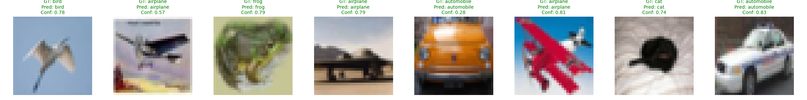

# 🧠 MiniViT - 从零实现 Vision Transformer 并在 CIFAR-10 上训练

> 🎓 本项目是我作的学习记录，完整实现了一个简化版的 Vision Transformer（ViT）模型，支持训练、评估、推理与可视化。

---

## ✨ 项目特点

- ✅ 从零实现 `PatchEmbedding`, `Multi-Head Attention`, `Transformer Encoder`
- ✅ 支持训练与验证集的 loss / acc 实时记录与绘图
- ✅ 训练最优模型自动保存为 `best_model.pt`
- ✅ 推理脚本 `inference.py` 可视化预测结果
- ✅ 使用 `tqdm` 实时可视化训练进度，适配低配设备

---

## 📁 项目结构

```

MiniViT/
├── models/
│   ├── patch\_embed.py        # Patch Embedding 模块
│   ├── transformer.py        # Attention + Encoder Block
│   └── vit.py                # ViT 主模型
├── train.py                  # 训练与评估入口脚本
├── inference.py              # 推理可视化脚本（生成 inference\_result.png）
├── utils.py                  # 工具函数：保存/加载/绘图
├── best_model.pt             # 训练中保存的最优模型权重
├── training_log.csv          # 训练记录日志
├── training_log.png        # loss/acc 曲线图
├── inference_result.png      # 推理可视化结果
└── README.md                 # 项目说明文档（本文件）

````

---

## 🧠 模型结构（MiniViT）

``` python
model = MiniViT(
    img_size=32,
    patch_size=4,
    embed_dim=256,
    depth=8,
    heads=8,
    num_classes=10
)
```


* 输入为 32×32 的彩色图像；
* 划分为 4×4 patch，共 64 个 patch；
* 每个 patch 通过线性映射为 256维向量；
* 添加 `[CLS]` token 和可学习位置编码；
* 堆叠 8 层 TransformerEncoder；
* 最后输出 `[CLS]` token 进行分类。

---

## 📈 训练结果（50 epoch）

* ✅ 最终验证集准确率达 **71.07%**
* ✅ 支持可视化训练过程：


---

## 🔍 推理可视化（inference.py）

使用训练好的模型，对测试集中图像进行推理，生成如下结果：



---

## 🚀 快速开始

```bash
# 训练模型（默认训练50轮）
python train.py

# 使用保存的模型进行推理
python inference.py
```

---

## 📦 环境依赖

```bash
torch>=2.0
torchvision
matplotlib
tqdm
pandas
```


---

